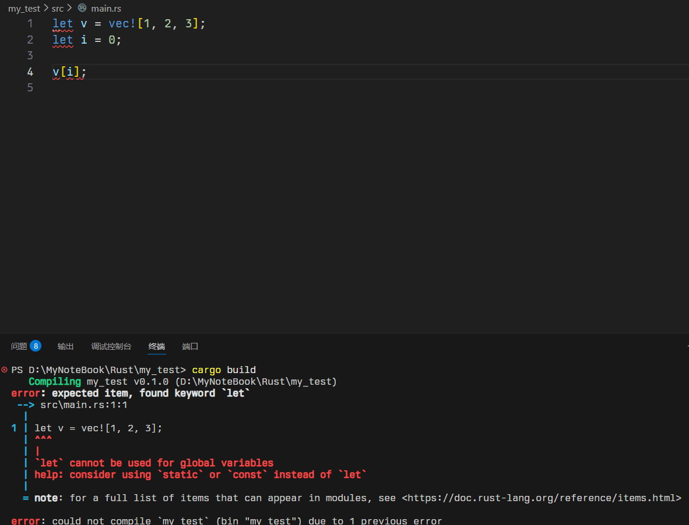

---
categories:
  - 学习笔记
date: 2025-12-22
description: 学习Rust语言。
slug: rust
tags:
  - Rust
title: Rust学习
cover:
  image: "1.png"
  relative: true
---

## 函数的返回需要确定
```rust
fn add(a:i32,b:i32) ->i32{

    a + b

}

fn main() {

    println!("{}",add(1, 2));

}
```
在Rust中， `fn` 用来定义函数。Rust不会自动推断函数的返回类型，故 `->i32` 只在函数定义的时候需要。一般定义变量时，
```rust
let x = 10;
let mut y =10;
```

Rust会自动推断。

**`-> i32` 一定要吗？为什么函数必须写？**
因为 **函数是对外接口**。
如果不写，那么Rust就不知道返回什么，他不会选择自己推断，而是让我们自己选择。如果不写返回值，就会返回`()`。

**`()` 到底是什么？**
答案：返回 `()`，表示“我完成了，但没有有用的值”
**常见整数类型对照表：**

|类型|含义|范围|
|---|---|---|
|`i32`|有符号 32 位|-21 亿 ~ +21 亿|
|`u32`|无符号 32 位|0 ~ 42 亿|
|`i64`|有符号 64 位|很大|
|`i128`|有符号 128 位|非常大|
|`usize`|平台相关|用于索引|
这是Rust 的**整数类型系统**，非常严谨。
因为 Rust 追求：

- **性能**
    
- **内存可控**
    
- **行为确定**
    

你用什么类型，Rust 就给你什么行为。

- `i` 是 `i32`
- 索引必须是 `usize`
必须写成：
```rust
fn main() {

    let v = vec![1, 2, 3];

    let i: usize = 0;

    v[i];

}
```
这是Rust在防止写Bug。