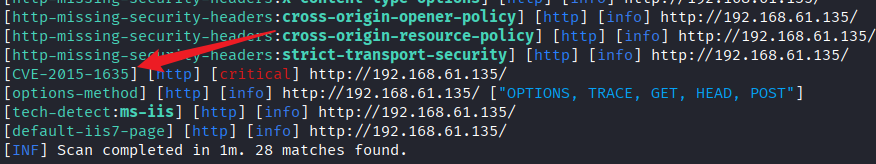
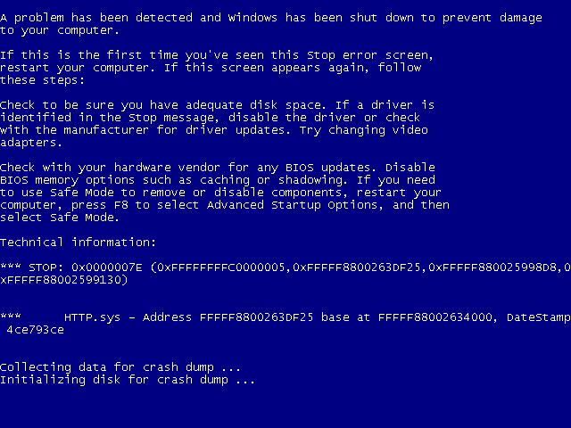

---
categories:
  - 网络安全
date: 2025-12-28
description: 小迪secWeb攻防学习笔记
slug: 2
tags:
  - 
title: Web攻防-41天
cover:
  image: "1.png"
  relative: true
---

# ASP默认安装-MDB数据库泄露下载
由于大部分ASP程序与ACCESS数据库搭建，但ACCESS无需连接，都在脚本文件中定义配置好数据库路径即用，不需要额外配置安装数据库，所以大部分提前固定好的数据库路径如默认未修改，当攻击者知道数据库的完整路径，可远程下载后揭秘数据实现攻击。

# ASP-中间件-CVE&短文件&解析&写权限
-HTTP.SYS(CVE-2015-1635)
1、漏洞描述
远程执行代码漏洞存在于 HTTP 协议堆栈 (HTTP.sys) 中，当 HTTP.sys 未正确分析经特殊设计的 HTTP 请求时会导致此漏洞。成功利用此漏洞的攻击者可以在系统帐户的上下文中执行任意代码。
2、影响范围
Windows 7、 Windows Server 2008 R2、 Windows 8、 Windows Server 2012、Windows 8.1 和 Windows Server 2012 R2且安装了 IIS6.0 以上的版本。
3、漏洞复现
扫描发现：



# IIS短文件
1、此漏洞实际是由 HTTP 请求中旧 DOS 8.3 名称约定（SFN）的代字符（~）引起的。它允许远程攻击者在Web根目录下公开文件和文件夹名称（不应该可被访问）。攻击者可以找到通常无法从外部直接访问的重要文件，并获取有关应用程序基础结构的信息。
2、漏洞成因：为了兼容16位的MS-DOS程序，Windows为文件名较长的文件（和文件夹）生成了对应Windows 8.3短文件名。在Windows下查看对应的短文件名，可以使用 `dir /x`。
3、应用场景：后台获取路径，数据库文件获取，其他敏感文件获取等。
4、利用工具：
https://github.com/irsdl/IIS-ShortName-Scanner

# IIS文件解析

IIS 6 解析漏洞
1、该版本默认会将 `*.asp;.jpg` 此种格式的文件名，当成ASP解析。
逻辑：
```text
请求：logo.asp;.jpg

IIS 判断脚本类型时看到：
logo.asp   ← OK，这是 ASP

至于 ";.jpg"？
当成 URL 参数，忽略
```
2、该版本默认会将 `*.asp/` 目录下的所有文件当成ASP解析。
如：`logo.asp;.jpg` `xx.asp/logo.jpg`
逻辑：
```text
xx.asp/logo.jpg

IIS 看到：
xx.asp  → ASP 应用入口

于是：
logo.jpg  → 在 ASP 解释环境中处理
```

IIS 7.x 解析漏洞
在一个文件路径（/xx.jpg）后面加上 `/xx.php` 会将 `/xx.jpg/xxphp` 解析为php文件。

以上两种。IIS6没有补丁，7版本有，所以IIS6危害更大。

# HTTP状态码
200：正常。
3XX：跳转，可能存在或不存在。
403：目录存在。
5XX：服务器错误，可能存在或不存在。