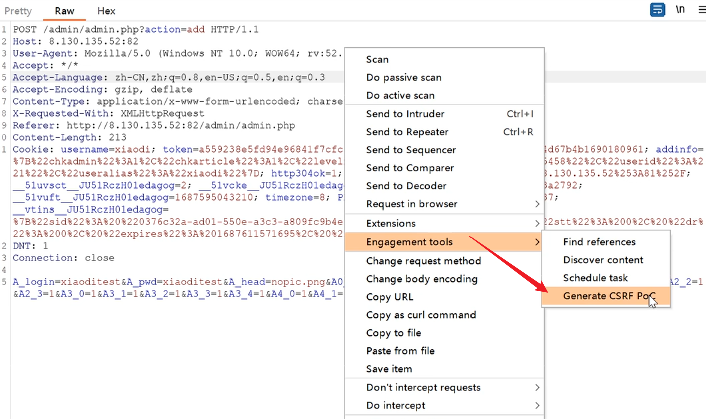
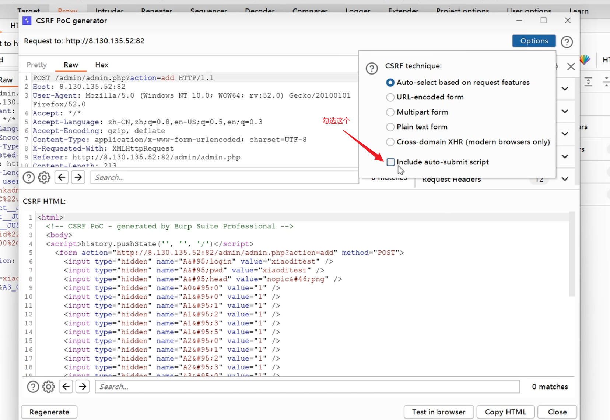
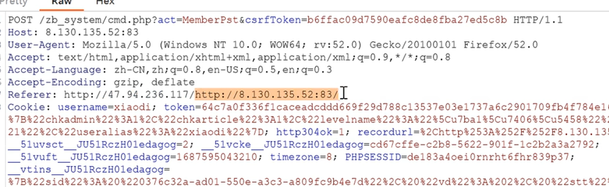
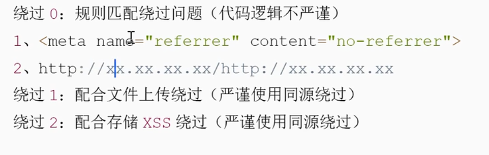

---
categories:
  - 网络安全
date: 2026-01-24
description: 小迪secWeb攻防学习笔记文件SCRF跨站点请求伪造
slug: 7
tags:
  - 
title: Web攻防-56天CSRF
cover:
  image: 1.png
  relative: true
---

# CSRF：跨站点请求伪造

条件：

1、需要请求伪造数据包

2、无过滤防护 有过滤能绕过

3、受害者需要触发（诱导）

# CSRF-无检测防护=检测&生成&利用

利用：burp专业版：

点击勾选，这个的意思是包含一个自动点击的代码（更方便钓鱼，打开就算点击触发）：

在html处删除原来的按钮，点击copy html，用自己的服务器部署后，当有人访问这个钓鱼页面，就能获取登陆凭据。

此处抓包的是一个增加用户的操作，制作成html后，如果被网站管理员触发，即可新建成功。

# CSRF-Referer 同源-规则&上传&XSS
**同源检测**：上面的例子可以明显看到，钓鱼网站ip和受害者网站ip并不是一个的。以此：拒绝外来ip即可有效防止。

来源检测：

1、基于严谨的检测绕过

2、基于不严谨的检测绕过

检测是否同源

目标：http://ip-a

攻击：http://ip-b

检测来源是 ip-a 同源就可以

全部对比：一一对应：配合xss 或 上传（触发数据包保证是同一来源）

匹配对比：有这个值就行(加入一个新的，有这个值，就绕过。)

逻辑绕过技术：在ip-b中创建一个ip-a/diaoyu.html就形如http://ip-b/http:i//p-a/diaoyu但是实战中目录不能//，所以基本很难实现。

**Referer检测**：服务器会检查请求是否从www.本身.com这个域名下来的，如果不是，就认为是非法的请求。（参考攻防世界例题，更改Referer:xxx.xxx.xxx即可实现一些简单绕过。）实战中：受害者不可能自己修改referer，所以不可能实现。

通过代码审计，找出漏洞。

# CSRF-Token 校验-值删除&复用&留空
判断：当对方浏览器token已经更新了，对比不上，代码判定为失效。

token：写没写都没用（不严谨）

复用

删除

置空 token=