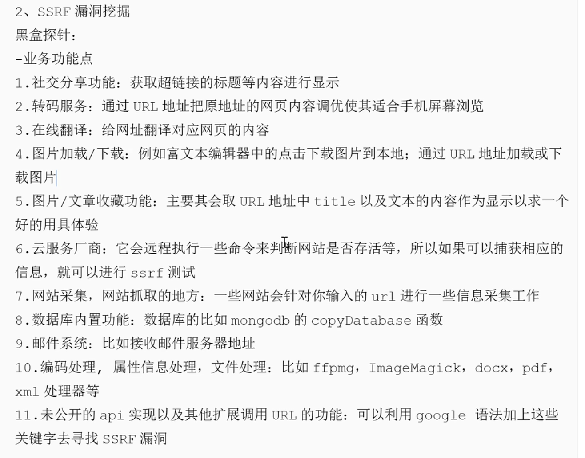
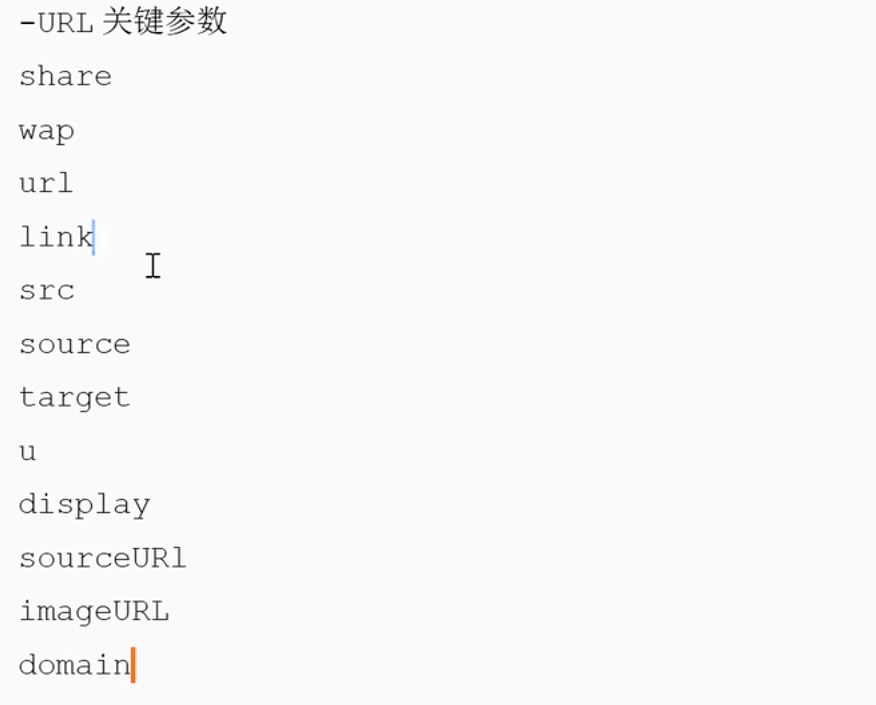
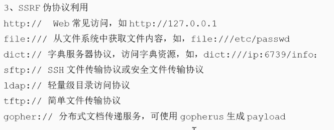
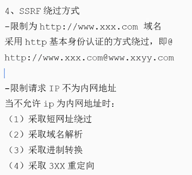

---
categories:
  - 网络安全
date: 2026-01-25
description: 小迪secWeb攻防学习笔记文件SSRF
slug: 8
tags:
  - 
title: Web攻防-57天SSRF服务端
cover:
  image: 1.png
  relative: true
---

# SSRF服务端请求伪造
服务端自己去请求，直接攻击服务器，通过内网进行攻击。与CSRF的区别是：一个是外面（通过凭据等）打进来，一个是里面打：让服务器请求127.0.0.1，如果127.0.0.1:80正好有个网站，那么就会显示。

**SSRF漏洞挖掘**：

URL关键参数：

绕过：

-通过ip地址进制转换绕过。

-创建一个域名，指向127.0.0.1。域名解析。

-写个0，举例：ping 0 -> ping 127.0.0.1

`gopher://` 工具：https://github.com/tarunkant/Gopherus ，分布式文档传递服务，可使用该工具生成payload。由于有部分协议http这类不支持，可以gopher来进行通讯（MySQL，redis等）应用：漏洞利用 或 信息收集 通讯相关服务。

相关问题：RCE无回显，ssrf无回显怎么办？答：正向链接（nc，启动个监听），返现链接。
参考漏洞：导出SSRF：
- https://forum.butian.net/share/1497
