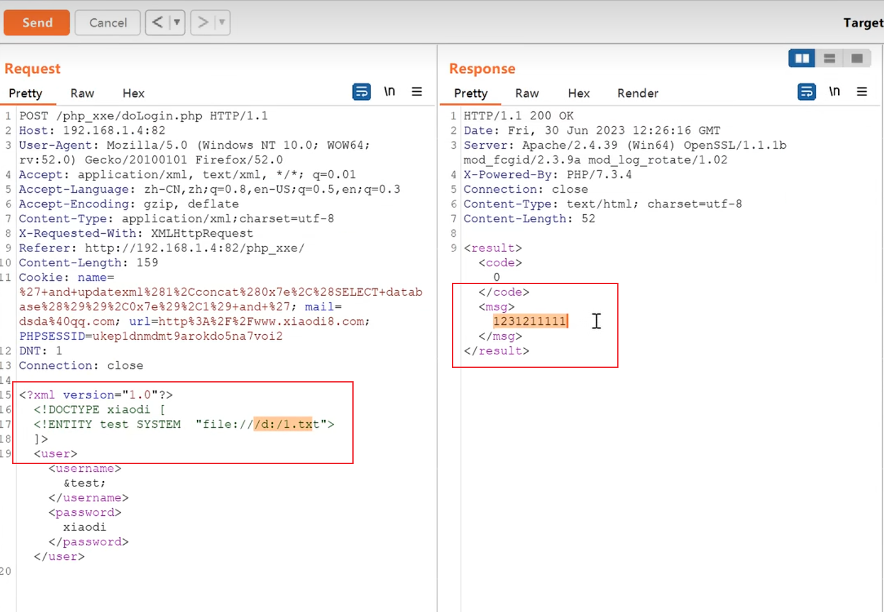
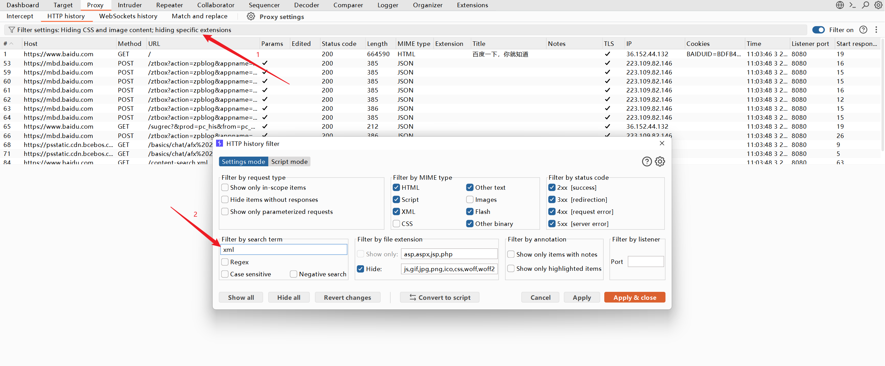

---
categories:
  - 网络安全
date: 2026-02-03
description: 小迪secWeb攻防学习笔记XML&XXE
slug: 8
tags:
  - 
title: Web攻防-59天XML&XXE
cover:
  image: 1.png
  relative: true
---

# XML&XXE 安全&无回显方案&OOB 盲注&DTD 实体&黑百盒
## 详细点：
XML被设计为传输和存储数据，XML 文档结构包括 XML 声明、DTD文档类型定义（可选）、文档元素，其焦点是数据的内容，其把数据从 HTML 分离，是独立于软件和硬件的信息传输工具。等同于 JSON 传输。XXE 漏洞发生在应用程序解析 XML输入时，没禁止外部实体的加载，导致可加载恶意外部数据，造成文件读取、命令执行、内网扫描
攻击内网等危害。

## XML 与 HTML 的主要差异：

XML 被设计为传输和存储数据，其焦点是数据的内容。

HTML 被设计用来显示数据，其焦点是数据的外观。

HTML 旨在显示信息，而 XML 旨在传输存储信息。

Example：网站的 xml 文件解析

**理解举例：**
关注数据格式，这个是 XML 的数据格式，就可以增加攻击payload。这边看content-type中有xml，所以代表这个是xml

## -XXE 黑盒发现：
1、获取到的 Content-Type 或数据类型为 xml 时，尝试 xml 语言 payload 进行测试（burp可以搜索关键字）。

2、不管获取的 Content-Type 类型或数据传输类型，均可尝试修改后提交测试 xxe 。

3、XXE 不仅在数据传输上可能存在漏洞，同样在文件上传引用插件解析或预览也会造成文件中的 XXE Payload 被执行。

## -XXE 白盒发现：
1、可通过应用功能追踪代码定位审计

2、可通过脚本特定函数搜索定位审计

3、可通过伪协议玩法绕过相关修复等