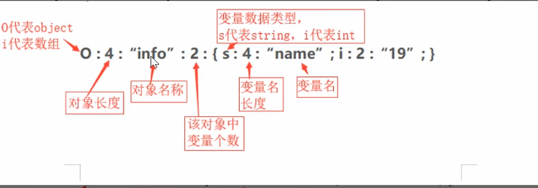

---
categories:
  - 网络安全
date: 2026-02-04
description: 小迪secWeb攻防学习笔记-PHP反序列化
slug: web-60-62-php-deserialization
tags:
  - 
title: Web攻防-60-62PHP反序列化
cover:
  image: 1.png
  relative: true
---

# 什么是反序列化操作？-类型转换
序列化：对象转换为数组或字符串等格式

反序列化：将数组或字符串等格式转换为对象
```php
serialize() //将对象转换成一个字符串
unserialize() //将字符串还原成一个对象
    
<?php
// 序列化：将对象/数组 → 字符串（便于存储/传输）
$data = array("name" => "admin", "role" => "user");
$serialized = serialize($data);
echo $serialized;
// 输出: a:2:{s:4:"name";s:5:"admin";s:4:"role";s:4:"user";}

// 反序列化：将字符串 → 对象/数组
$unserialized = unserialize($serialized);
print_r($unserialized);
```

序列化格式解读：



```php
a:2:{s:4:"name";s:5:"admin";s:4:"role";s:4:"user";}
│ │  │ │  │     │ │   │
│ │  │ │  │     │ │   └── 值内容
│ │  │ │  │     │ └── 值长度
│ │  │ │  │     └── s = string类型
│ │  │ │  └── 键内容  
│ │  │ └── 键长度
│ │  └── s = string类型
│ └── 2个元素
└── a = array类型
```

**类型标识符**

```php
s:5:"hello"    → 字符串，长度5
i:123          → 整数
b:1            → 布尔值 (1=true, 0=false)
N;             → NULL
a:2:{...}      → 数组，2个元素
O:4:"User":2:{...} → 对象，类名长度4，2个属性
```

**魔术方法**

```php
__construct(): 构造函数，在实例化一个对象的时候，首先会去自动执行的一个方法；

__destruct(): 析构函数，在对象的所有引用被删除或者当对象被显式销毁时执行的魔术方法。

__toString(): echo或者print只能调用字符串的方式去调用对象，即把对象当成字符串使用，此时自动触发toString()

__invoke(): 把test对象当成函数test()来调用,此时触发invoke()

__call($method, $arguments): 调用的不存在的方法的名称和参数

__sleep()：在调用 serialize() 函数序列化对象之前被调用

__wakeup()：调用unserialize()反序列化函数时反序列化之后调用

__get($property): 调用的成员属性不存在，用于获取对象的属性值。

__set($property, $value): 给不存在的成员属性赋值。用于设置对象的属性值。

__isset($property): 对不可访问属性使用 isset() 或 empty() 时，__isset() 会被调用。用于检测属性是否被设置。

__unset($property): 在使用 unset() 删除一个不可访问属性时自动调用的方法。用于删除对象的属性。

__callStatic($method, $arguments): 静态调用或调用成员常量时使用的方法不存在。用于处理静态方法的调用。
```

**常见的魔术方法**：

```php
__construct()：对象被创建时触发（反序列化时通常不触发，但在生成Payload脚本时会用到）。
__destruct()：对象被销毁时触发（脚本执行结束或对象不再被引用时）。这是最常见的反序列化入口点。
__wakeup()：执行 unserialize() 之前触发。
__sleep()：执行 serialize() 之前触发。
__toString()：把对象当成字符串使用时触发（例如 echo $obj;）。
__invoke()：把对象当成函数调用时触发（例如 $obj();）。
__call()：调用不存在的方法时触发。
__get() / __set()：读取或设置不存在/不可访问的属性时触发。
```

# CTF中常见坑点与技巧

1、对象变量属性：

public（公共的）：在本类内部、外部类、子类都可以访问

protect（受保护的）：只有本类或子类或父类中可以访问

private（私人的）：只有本类内部可以使用

2、序列化数据显示：

#### 1. 属性的可见性（Public / Private / Protected）

这是最容易踩的坑。

- **Public**: 序列化出来就是变量名。
- **Private**: 序列化出来是 `\00类名\00变量名` （`\00` 是空字节 ASCII 0）。
- **Protected**: 序列化出来是 `\00*\00变量名`。

**解决办法**：

- 在写 EXP 脚本时，直接把属性都改成 `public` 通常也能反序列化成功（PHP特性）。
- 或者在生成 Payload 后，手动把空字符 `%00` 进行 URL 编码。

#### 2. 字符串逃逸

**PHP 在反序列化时，底层解析是严格按照“字符串长度”来读取的。**如果替换操作导致字符串的**实际长度**发生了变化，但序列化字符串头部记录的**长度数值**没有同步变化，就会破坏原本的结构。

这时候，我们可以利用这个长度差，把我们构造的恶意 Payload “挤”出来，或者把后面的结构“吃”进去，从而改变对象的属性。

```php
<?php
// 反序列化引擎按照长度读取字符串，读完就停！
$str = 'a:2:{s:4:"name";s:5:"admin";s:3:"age";s:2:"18";}';
//                       ↑ 读5个字符

// 即使后面有垃圾数据也能正常解析
$str = 'a:2:{s:4:"name";s:5:"admin";s:3:"age";s:2:"18";}xxxxx垃圾数据';
var_dump(unserialize($str));  // 正常解析！
```

##### 情况一：关键词变长（增多）—— 把 Payload “挤”出来

假设代码中有一个过滤功能，把所有的字符 `'x'` 替换成 `'yy'`（1个字符变成2个）

```php
//例题1
function filter($str){
    return str_replace('x', 'yy', $str);
}
// 原始类
class A {
    public $name = 'user';
    public $pass = '123456';
}
```

**目标**：我想把 `$pass` 修改为 `"hacker"`。

**逻辑推演**：

1. 正常序列化结果（假设 name 输入 user）：
   `...s:4:"name";s:4:"user";s:4:"pass";s:6:"123456";}`
2. PHP 解析时，读到 `s:4:"user"`，它就乖乖往后读4个字符。
3. **攻击思路**：如果我输入很多 `x`，经过 `filter` 后，字符串变长了。原本记录的长度（比如10）不够用了，多出来的字符就会被当作**后面的代码**来解析。

**操作步骤**：
我们需要构造一个 Payload，使得它正好被“挤”到 `$name` 值的外面，成为一个新的属性定义。

我们想要的最终结构（Payload）：
`";s:4:"pass";s:6:"hacker";}`
这段字符串长度是 27。

**计算数学题**：

- 我们要逃逸出的字符长度是 27。
- 每个 `'x'` 变成 `'yy'`，长度增加 1。
- 所以我们需要输入 27 个 `'x'`。

**攻击 Payload**（输入给 name）：
`xxxxxxxxxxxxxxxxxxxxxxxxxxx";s:4:"pass";s:6:"hacker";}`

**发生过程**：

1. **序列化**：PHP 记录 name 长度为 27 + 27 = 54。
   `...s:54:"xxxxxxxxxxxxxxxxxxxxxxxxxxx";s:4:"pass";s:6:"hacker";}";...`
2. **过滤（变长）**：27个 x 变成了 54个 y。实际内容变成了 54个y + 我们的Payload。
   `...s:54:"yyyyyyyyyyyyyyyyyyyyyyyyyyyyyyyyyyyyyyyyyyyyyyyyyyyyyy";s:4:"pass";s:6:"hacker";}";...`
3. **反序列化**：
   - PHP 读到 `s:54`。
   - 它往后数 54 个字符，正好读完所有的 `y`。
   - 此时，虽然字符串没结束，但 PHP 认为 `$name` 的值已经读取完毕了！
   - **关键点**：紧接着的 `";s:4:"pass";...` 本来是字符串内容，现在被 PHP 当作了**代码结构**解析！
   - 于是，`$pass` 被成功覆盖为 `hacker`。后面的原始数据会被忽略或丢弃。

##### 图解：

```php
a:2:{s:4:"name";s:5:"admin";s:3:"age";s:2:"18";}xxxxx垃圾数据
│                                              │
│←──────────── 完整的序列化结构 ──────────────→│←── 忽略 ──→│
│                                              │
└── 解析到这个 } 就结束了，后面的全部丢弃 ──────┘
```

PHP读到 `}` 后就结束了解析，之后不管后面是什么，都会忽略。这就是 PHP **“读完就停，后面不管”** 的特性。

```php
a:2:{s:4:"name";s:5:"admin";s:3:"age";s:2:"18";}xxxxx垃圾数据
↓
a:2:{ ... }   → 这是一个数组，有2个元素，开始解析大括号内容

  s:4:"name"  → 第1个键：字符串，长度4，读取"name"
  s:5:"admin" → 第1个值：字符串，长度5，读取"admin"
  
  s:3:"age"   → 第2个键：字符串，长度3，读取"age"  
  s:2:"18"    → 第2个值：字符串，长度2，读取"18"

}             → 数组结束，解析完成！

xxxxx垃圾数据  → 直接忽略，不处理，不执行，不报错
```

而针对上面的例题1，我们通过输入很多 `x` 变成 `yy`，把字符串挤长了。

**攻击后的字符串看起来是这样的：**

```php
...s:54:"yyyy...yyyy";s:4:"pass";s:6:"hacker";}";s:4:"pass";s:6:"123456";}
```

请注意看我用**粗体**标出的部分：

1. `s:54:"yyyy...yyyy"`：这是被挤出来的 `$name`。
2. `;s:4:"pass";s:6:"hacker";`：这是我们构造的 Payload，成功注入进去了。
3. **`}`**：**这是我们构造的闭合括号！**
   - PHP 读到这个括号，认为“对象解析完毕了！”
4. **`;s:4:"pass";s:6:"123456";}`**：**这是原本正常的代码，变成了垃圾数据。**

正是因为 PHP **“读完就停，后面不管”** 的特性，我们构造的 Payload 里那个提前闭合的 `}` 才能生效，从而把原本合法的代码（比如原来的密码字段）变成了被遗弃的“垃圾数据”。

# 反序列化链项目 PHPGGC&NotSoSecure

https://github.com/NotSoSecure/SerializedPayloadGenerator

这个是根据框架来生成的，不是原生。（python是原生。）
