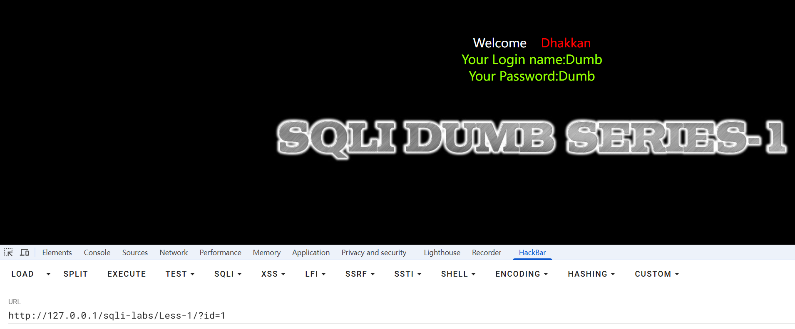
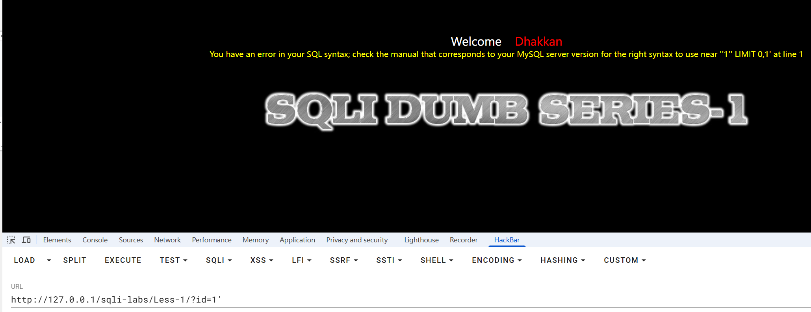

---
categories:
  - 网络安全
date: 2025-12-28
description: 小迪secWeb攻防学习笔记
slug: 3
tags:
  - 
title: Web攻防-42天
---

# 数据库管理模式（MySQL）

**1、数据库统一管理（root用户）**

每个网站数据库都由root用户统一管理
```text
网站A：127.0.0.1:80 网站目录：/www/var/web1/ 数据库root用户 web1
网站B：127.0.0.1:81 网站目录：/www/var/web2/ 数据库root用户 web2

示例：
mysql
	root（默认自带）
		网站A testA
		网站B testB
```

2、数据库一对一管理（不用用户）
自己的网站单独创建数据库用户去管理自己的数据库
每个网站单独创建一个数据库用户去管理自己的数据库
```text
网站A：127.0.0.1:80 网站目录：/www/var/web1/ 数据库web1用户 web1
网站B：127.0.0.1:81 网站目录：/www/var/web2/ 数据库web2用户 web2

示例：
	testA用户
		网站A testA
	testB用户
		网站B testB
```

# MySQL等级结构
```text
mysql 
	数据库A
		表名
			列名（字段）
				数据
	数据库B
		表名
			列名（字段）
				数据
				
MySQL（数据库服务器）
 └── 数据库（database / schema）
      └── 表（table_name）
           └── 字段 / 列（column_name）
                └── 数据（value）
                
MySQL（数据库服务器 / DBMS）
 └── information_schema（系统数据库，用来描述数据库本身）
     ├── schemata（记录“有哪些数据库”）
     │    └── schema_name（数据库名）
     │
     ├── tables（记录“数据库里有哪些表”）
     │    ├── table_schema（该表属于哪个数据库）
     │    └── table_name（表名）
     │
     └── columns（记录“表里有哪些字段”）
          ├── table_schema（字段属于哪个数据库）
          ├── table_name（字段属于哪张表）
          └── column_name（字段名）
          
MySQL（数据库服务器）
 ├── 业务数据库（如 sqli）
 │    └── 业务表（如 users）
 │         └── 业务字段（如 username / password）
 │              └── 真实数据（admin / 123456）
 │
 └── information_schema（系统数据库）
      ├── schemata
      │    └── schema_name（数据库名）
      │
      ├── tables
      │    ├── table_schema（所属数据库）
      │    └── table_name（表名）
      │
      └── columns
           ├── table_schema（所属数据库）
           ├── table_name（所属表）
           └── column_name（字段名）
```

Access（单个）等级结构
```text
Access(单个)
	表名
		列名（字段）
			数据
```

MySQL注入查询表：


# 以sql-labs less-1为例，学习SQL注入：
## 1）第一步：确认“是否可注入”
原始SQL代码：
```php
$sql="SELECT * FROM users WHERE id='$id' LIMIT 0,1";
```
拆解这一条SQL：
```sql
SELECT *          -- ① 查询哪些列
FROM users        -- ② 从哪张表
WHERE id = '$id'  -- ③ 条件（漏洞就在这里）
LIMIT 0,1;        -- ④ 限制返回行数
```
**固定认知**：

> [!NOTE]
> SQL 注入 99% 都发生在 WHERE / ORDER BY / LIMIT / INSERT VALUES 这些“拼接用户输入”的地方

正常访问：`id=1` 页面正常，PHP拼接的是：
```sql
SELECT * FROM users WHERE id='1' LIMIT 0,1;
```

而访问 `?id=1'` 时，拼接的SQL语句是：
```sql
SELECT * FROM users WHERE id='1'' LIMIT 0,1;
```
在这里需要知道一条死规矩：**在 SQL 里，字符串必须被成对的引号包住。**
比如：
```sql
'abc'
'123'
'hello world'
```
必须是：

- 左边有一个 `'`
    
- 右边必须再有一个 `'`  
     这中间的内容，数据库才知道是一个“字符串”。

原始SQL语句是：
```sql
SELECT * FROM users WHERE id='$id' LIMIT 0,1;
```
这里有一个**已经写好的单引号结构**：
```sql
id = '      '
      ↑    ↑
    开始  结束
```
数据库的理解是，`$id` 这个变量的值会被当成字符串内容左右引号已经标好了。
正常输入1时：
```sql
?id=1
```
拼接后：
```sql
id = '1'
```
结构正常。
如果输入一个 `'` 单引号：
```sql
?id=1'
```
拼接后会变成：
```sql
id = '1''
```
逐字符拆解：
```sql
'   1   '   '
↑       ↑   ↑
开始    结束 ？？？
```
数据库此时:
> 看到：
> 
> - 第一个 `'`：字符串开始
>     
> - 第二个 `'`：字符串结束
>     
> - **第三个 `'`：？？？**
>     
> 
> 你这个引号是想干嘛？
> 
> - 开新字符串？
>     
> - 结束字符串？
>     
> - 还是你写错了？
>     

最后**数据库已经“读不下去了”**

### 那么数据库为什么报错？
因为 SQL 解析器是**从左到右严格读字符的**。
当它发现：
- 引号数量不对
- 字符串边界混乱
它就会直接报错，比如：

那为什么两个 `''` 反倒没事：

这是一个**非常关键的知识点**。
SQL里 `''` 表示的**是一个“空字符串”**
所以当输入：
```sql
?id=1''
```
SQL 变成：
```sql
id = '1'''
```
拆解：
```sql
'   1   ''   '
↑       ↑↑   ↑
开始    空串  结束
```
数据库此时能完整解释：
- `'` → 开始字符串
- `1` → 内容
- `''` → 一个空字符串
- `'` → 结束字符串
**语法又“凑齐”了**
所以它不报错。

## 2）第二步：判断注入类型（是否 UNION 做准备）
做一个“逻辑真假测试”（确认能影响 WHERE 条件）：
访问：
```bash
?id=1' AND 1=1 --+
```
在访问：
```bash
?id=1' AND 1=2 --+
```
**观察：**
- `AND 1=1` 页面正常
- `AND 1=2` 页面变“空/不同”

 说明：你能控制 WHERE 条件真假 → 注入成立。
 （`--+` 是注释，作用是把后面残余的 `'` 或 SQL 片段吃掉。某些环境也能用 `#`。）
 **这句话的意思是：**

> 👉 如果你输入的内容，能决定数据库“查得到数据还是查不到数据”，  
> 👉 并且网页显示结果真的跟着变了，  
> 👉 那就说明：**你输入的东西真的在参与数据库判断（注入成功）**

### 对比：
这是语句原来想要的，就是“去 users 表里找 id 等于 1 的那一行”
```sql
SELECT * FROM users WHERE id='1' LIMIT 0,1;
```
而这两句话：
**必真的情况**
```sql
?id=1' AND 1=1 --+
```
SQL看到的是：
```sql
WHERE id='1' AND 1=1
```
数据库怎么想的？

> “找 id=1 的用户，  
> 并且 1=1 也成立  
> → **那就正常查**”

所以：**页面和正常访问一样**。

**必假的情况**
```sql
?id=1' AND 1=2 --+
```
SQL看到的是：
```sql
WHERE id='1' AND 1=2
```
数据库怎么想的？

> “找 id=1 的用户，  
> 但是 1=2 永远不成立  
> → **条件整体为假**  
> → 一条数据也不返回”

所以：**页面变空 / 没内容 / 显示不同**。

真正的含义是：
```text
如果我输入一个永远为真的条件，页面正常；  
输入一个永远为假的条件，页面就没数据，  
那就说明：  
-> 我的输入已经被当成 SQL 逻辑执行了（注入成立）
```
简单理解就是：
能用 AND 1=1 / AND 1=2 控制“有没有数据返回”，  
就说明你能控制 WHERE 条件 → 注入成立。

## Step 3：确定列数（UNION 注入必做）
用 `ORDER BY` 递增试：

`?id=1' ORDER BY 1 --+`  
`?id=1' ORDER BY 2 --+`  
`?id=1' ORDER BY 3 --+`  
……

**你要观察：**

- 哪一个 N 开始报错（比如 4 报错，3 不报错）

**原理：**  
`ORDER BY N` 表示按第 N 列排序。  
如果原查询只有 3 列，你写 `ORDER BY 4` 就会：  
✅ 数据库报“未知列/超出范围”的错

**结论：**

- 若 `ORDER BY 4` 报错 → **列数 = 3**

## Step 4：找“回显列”（哪一列能显示在页面）

假设你测出来列数是 3（你以真实结果为准）：

`?id=-1' UNION SELECT 1,2,3 --+`

**为什么用 -1？**  
让原查询 `id=-1` 查不到东西，页面显示的就是 UNION 那行，回显更干净。

**你要观察：**  
页面上出现了 `1`/`2`/`3` 中的哪个数字，出现哪个数字，哪个就是回显位。

## Step 5：开始“读信息”（从可见回显列输出）

假设第2列能回显（举例），那么：

- 数据库名：`database()`
    
- 版本：`version()`
    
- 当前用户：`user()`

例如（仍按 3 列举例）：  
`?id=-1' UNION SELECT 1,database(),3 --+`

技术路线：ORDER BY → UNION → information_schema → dump。


数据库在执行这条 SQL 时，内心是这样想的：

> “我当前正在使用数据库 `sqli`，  
> 你让我查 `users`，  
> 那我就去 `sqli.users` 里查。”

只有当需要跨库查询，才开始指定。