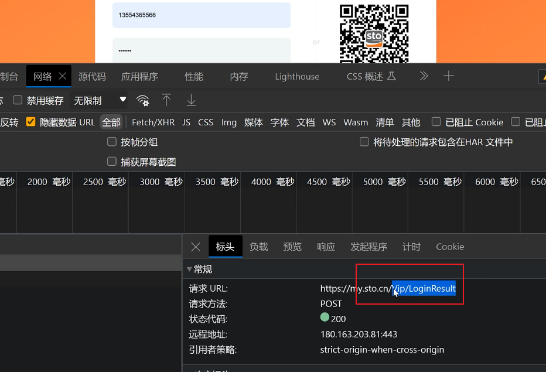
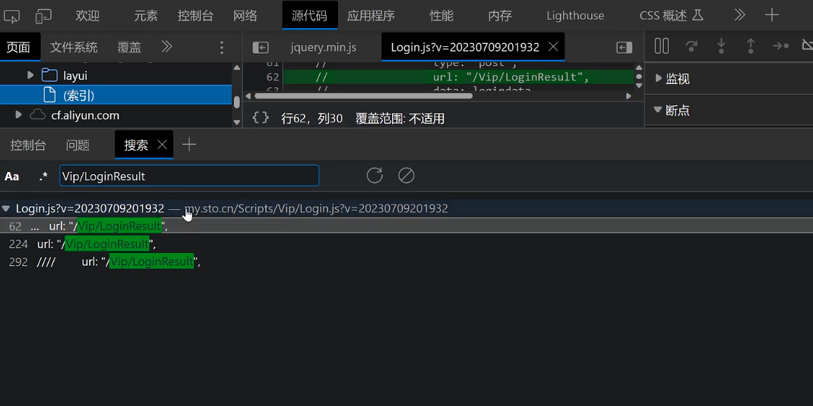
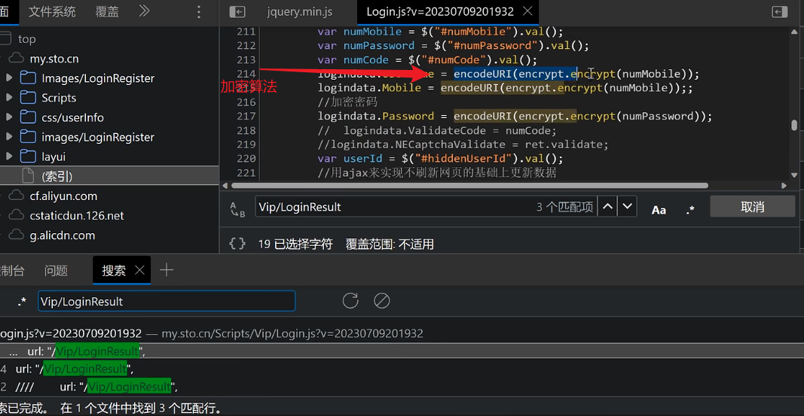
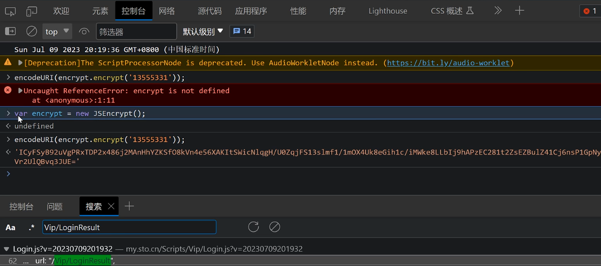
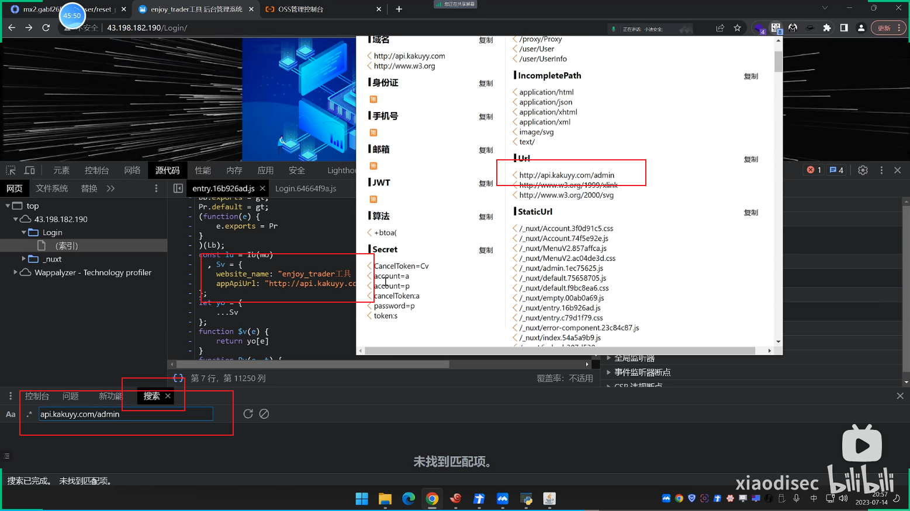

---
categories:
  - 网络安全
date: 2026-02-15
description: 小迪secWeb攻防学习笔记文件
slug: web-js
tags:
  - 
title: Web攻防-63-65天-JS应用
cover:
  image: 1.png
  relative: true
---

# 0x01 前端加密算法寻找步骤

1、搜索该路径，找到算法：

2、`Ctrl + F` ：

3、控制台复现

# 0x02为什么要学习？以及获取加密算法后集成到burp

利用插件：https://github.com/c0ny1/jsEncrypter

JS存在：

1、会增加攻击面（URL、接口、分析调试代码逻辑）

2、敏感信息（用户密码、ak/sk、token/session）

3、潜在危险函数（eval、dangerallySetInnerHTML）

4、开发框架类（寻找历史漏洞：Vue、NodeJS、Angular）

打包器 Webpack：PackerFuzzer

AK / SK 云安全利用：工具箱 CF

浏览器插件：Pentestkit FindSomething Wappalyzer（前期的 JS 收集项目）

**技巧**：如果制作了 JS 验证，可以通过burp修改返回包，比如发送页面后209，burp修改返回页面改成200。

通过插件搜索找到信息泄露：

